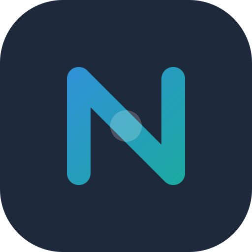

<p align="center">
  
</p>

<h1 align="center">Nexus Tasks</h1>

<p align="center">
  <strong>The AI-Powered, Extensible Project Management Platform for Developers</strong>
</p>

<p align="center">
  <a href="https://github.com/AshvinBambhaniya/nexus-tasks/actions/workflows/backend-ci.yml"></a>
  <a href="https://github.com/AshvinBambhaniya/nexus-tasks/actions/workflows/frontend-ci.yml"></a>
  <a href="https://artifacthub.io/packages/helm/nexus-tasks/nexus-tasks"></a>
  <br />
  
  
  
</p>

---

Nexus Tasks bridges the gap between personal productivity and team collaboration. Built strictly for developers, it eliminates the configuration bloat of enterprise suites (like Jira) while providing the advanced features—like Artificial Intelligence and real-time integrations—that simple to-do apps lack.

## Why Nexus Tasks?

Modern developers need speed, seamless communication, and automated workflows. Nexus Tasks delivers a **Hybrid Workspace** model combined with next-generation developer tooling:

1.  **Unified Context:** Manage private side-projects and shared team sprints in a single interface without endless context switching.
2.  **AI-Native Workflow:** From drafting tasks to summarizing 50-comment threads, AI is built directly into the core loop.
3.  **Developer-First Extensibility:** Exposes a standalone Model Context Protocol (MCP) server so autonomous agents can interact with your tasks and projects.
4.  **Simplicity over Configuration:** Opinionated agile workflows (To Do -> In Progress -> Done) allow teams to start shipping immediately.

## Key Features

- **AI Productivity Suite:** Magic Draft task generation, one-click comment thread summarization, and automated weekly sprint reports.
- **Model Context Protocol (MCP):** Connect your favorite AI agents (like Claude Desktop) directly to your workspaces via our standalone MCP server.
- **Real-Time Collaboration:** Instant push updates, a unified notification inbox, and an `@mention` engine powered by WebSockets.
- **Multiple Views:** Toggle seamlessly between visual Kanban boards and high-density Task Tables.
- **Secure Rich Text Editing:** Write robust specs and comments using a safe, DOMPurify-sanitized Markdown editor.
- **Role-Based Access & Workspaces:** Granular permissions (Admin/Member/Viewer) operating across distinct Personal and Team workspaces.

## Tech Stack & Architecture

**Frontend**
- **Nuxt 4** (Vue 3) / **TypeScript**
- **Tailwind CSS 4**
- **TipTap / DOMPurify / Marked** (Rich Text & Safe Markdown)
- **Pinia** (State Management)

**Backend**
- **Go 1.26** (Fiber Framework)
- **Goqu** (SQL Builder & Unit of Work)
- **OpenAI API** (AI Feature Integrations)
- **Watermill & Redis** (Pub/Sub Event-Driven Background Workers)
- **PostgreSQL / MySQL / SQLite**
- **WebSockets** (Real-Time Hub)

*The backend utilizes a decoupled event-driven architecture. Background workers handle intensive tasks (like SMTP Welcome Emails and Workspace Invitations) via a Dead Letter Queue (DLQ) enabled Pub/Sub system.*

## Getting Started

### Prerequisites
- Docker & Docker Compose
- Node.js 22+
- Go 1.26+

### Quick Start (Docker)

To run the entire stack (Frontend, Backend, Database, Redis, Mailpit) in development mode:

1. Clone the repository:
   ```bash
   git clone https://github.com/AshvinBambhaniya/nexus-tasks.git
   cd nexus-tasks
   ```

2. Configure your environment (optional but recommended for AI features):
   Add your `OPENAI_API_KEY` into `backend/.env.docker` or `backend/.env`.

3. Start the services:
   ```bash
   docker-compose up --build
   ```

The application will be available at:
- **Frontend:** [http://localhost:3000](http://localhost:3000)
- **API:** [http://localhost:8000](http://localhost:8000)
- **Mailpit (Local Email Preview):** [http://localhost:8025](http://localhost:8025)

### Local Development Setup

#### 1. Backend

Navigate to the backend directory:

```bash
cd backend
```

Copy the example environment file and configure it:

```bash
cp .env.example .env
```

Install Go dependencies:

```bash
go mod download
```

Run database migrations:

```bash
go run app.go migrate up
```

Start the API server:

```bash
go run app.go api
```

Start the background worker:

```bash
go run app.go worker
```

**Start the MCP Server (For Agent Integrations):**
```bash
go run app.go mcp
```

#### 2. Frontend

Navigate to the frontend directory:

```bash
cd frontend
```

Install dependencies:

```bash
npm install
```

Start the development server:

```bash
npm run dev
```

### Kubernetes Deployment (Helm)

We provide an industry-standard Helm chart for production-ready deployments.

#### 1. Add the Helm Repository

```bash
helm repo add nexus-tasks https://AshvinBambhaniya.github.io/nexus-tasks/
helm repo update
```

#### 2. Install the Chart

```bash
# Install with default values
helm install nexus-tasks nexus-tasks/nexus-tasks
```

For detailed Kubernetes configuration and custom values, see [deploy/helm/nexus-tasks/README.md](deploy/helm/nexus-tasks/README.md).


## Contributing

Contributions are heavily encouraged! Please read the source code and existing issues before contributing.
1. Fork the repository.
2. Create your feature branch (`git checkout -b feature/amazing-feature`).
3. Commit your changes using [Conventional Commits](https://www.conventionalcommits.org/).
4. Push to the branch (`git push origin feature/amazing-feature`).
5. Open a Pull Request.

Please see our [CONTRIBUTING.md](CONTRIBUTING.md) for detailed guidelines.


## License

This project is licensed under the **GNU Affero General Public License v3.0 (AGPL-3.0)** - see the [LICENSE](LICENSE) file for details.
