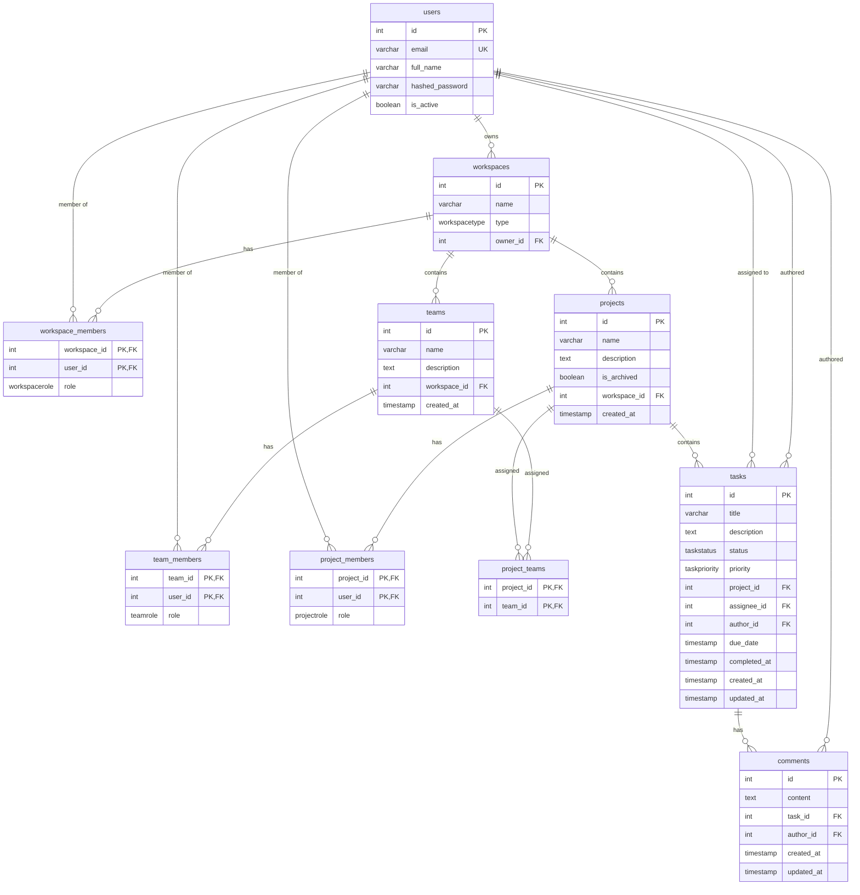

# Database Diagram

This document contains the ER diagram for the database schema based on the migrations.

## Enums

- workspacetype: PERSONAL, TEAM
- workspacerole: ADMIN, MEMBER, VIEWER
- teamrole: ADMIN, MEMBER
- projectrole: ADMIN, MEMBER, VIEWER
- taskstatus: TODO, IN_PROGRESS, DONE, BACKLOG
- taskpriority: P0, P1, P2, P3

## Relationships Summary

- A user can own multiple workspaces.
- Workspaces have members (users) with roles.
- Workspaces contain teams and projects.
- Teams have members (users) with roles.
- Projects have members (users) with roles and can be assigned teams.
- Projects contain tasks.
- Tasks can be assigned to users and have an author.
- Tasks have comments, each with an author.
